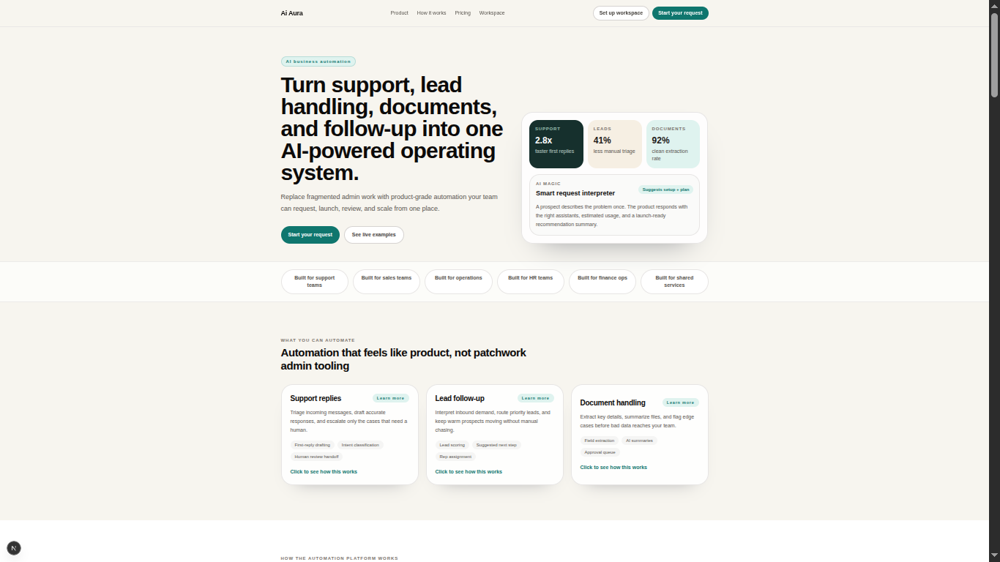
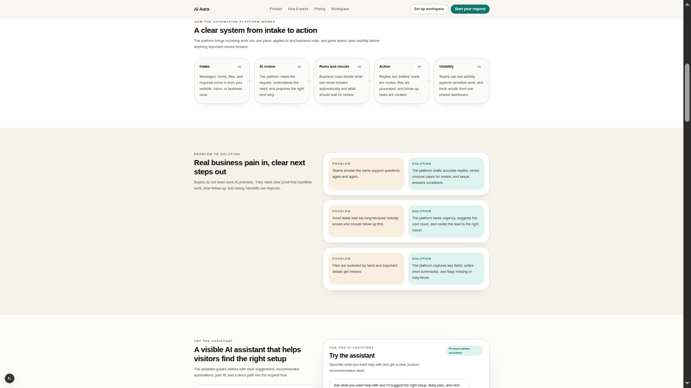
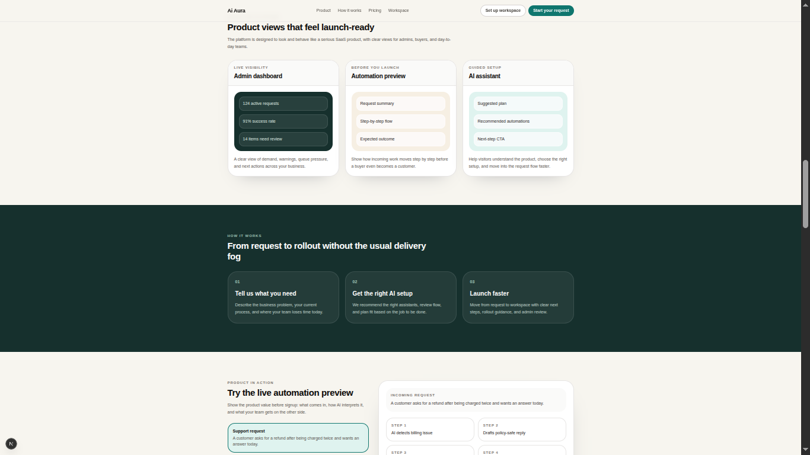
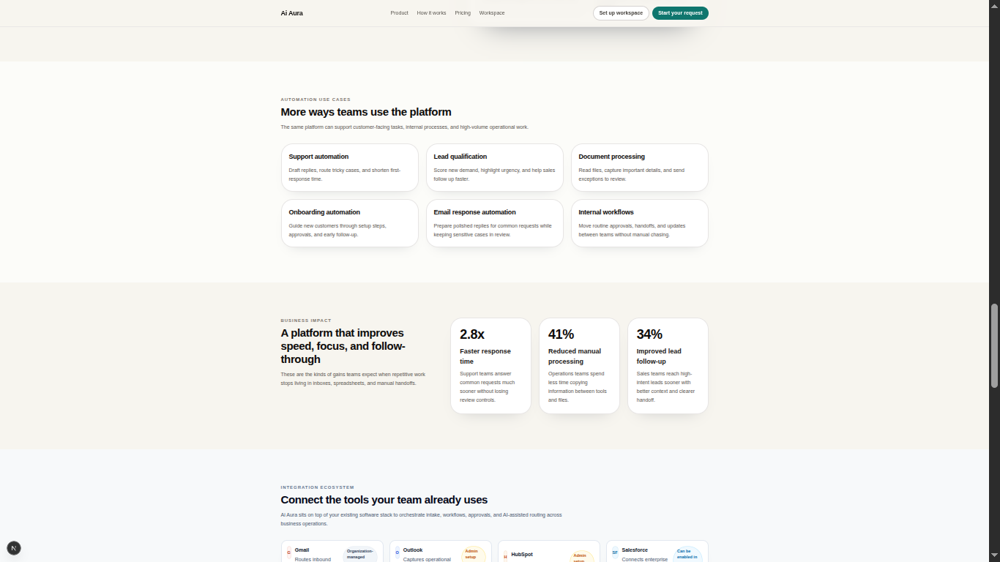
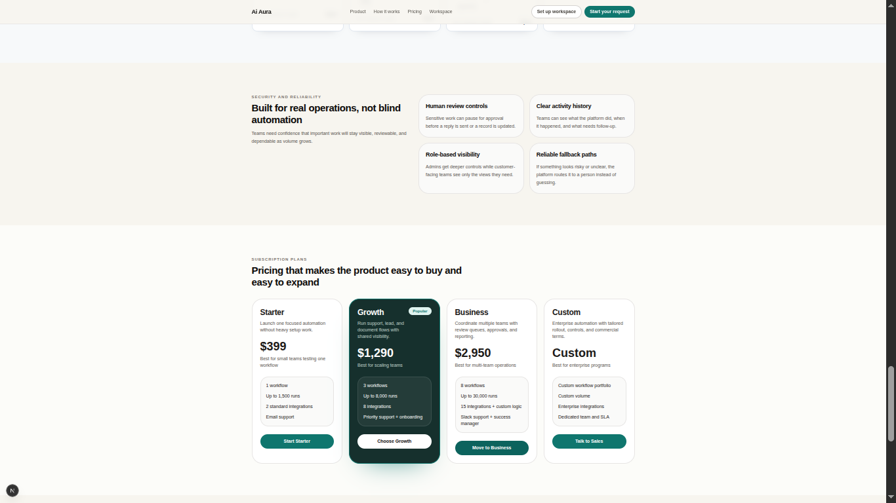
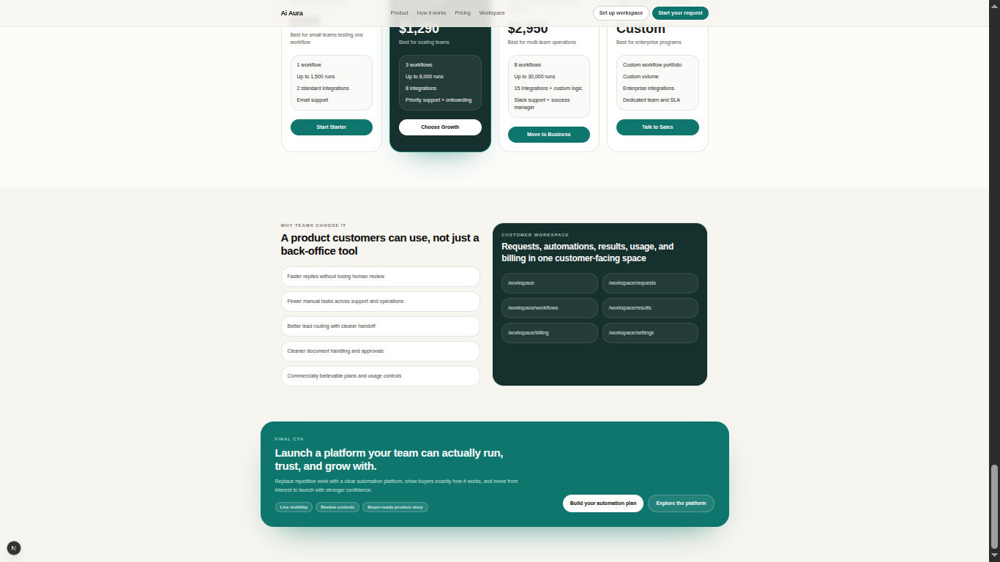

# 🚀 AI Automation Agents Dashboard (Next.js + Ollama)

A modern AI-powered frontend platform for showcasing, testing, and simulating **AI automation agents** for real-world business workflows.

This project demonstrates how AI can be integrated into enterprise systems like HR, Finance, Support, and Workflow Automation.

---

## ✨ Key Features

- 🤖 AI Agent Simulation Interface  
- 📊 Enterprise Dashboard UI  
- ⚡ Real-time AI responses (via Ollama)  
- 🔁 Fallback demo mode for portfolio usage  
- 🧠 Modular AI agent architecture  
- 🎯 Built for showcasing AI business automation  

---

## 🖥️ Product Showcase


### 🌐 Frontend Product Experience

<p align="center">
  
  
  
  
  
  
</p>

---
---

### 📊 Admin Dashboard (Full System)

<p align="center">
  
  
  
  
  
  
  
  
  
  
  
  
  
</p>

---


## ⚙️ Tech Stack

- **Frontend:** Next.js (App Router)  
- **Styling:** Tailwind CSS  
- **AI Runtime:** Ollama  
- **Model:** llama3.2:3b  
- **State Management:** React Hooks / Context  
- **Architecture:** Modular AI Agent UI  

---

## 🚀 Getting Started

### 1. Clone the repository

```bash
git clone https://github.com/YOUR_USERNAME/YOUR_REPO.git
cd YOUR_REPO
